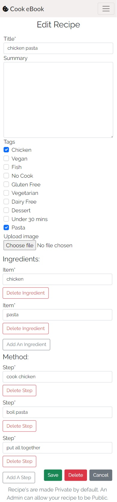
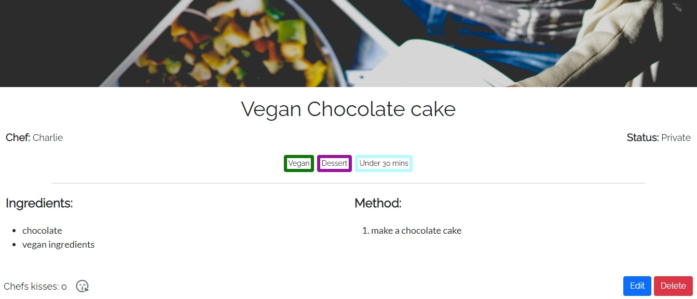
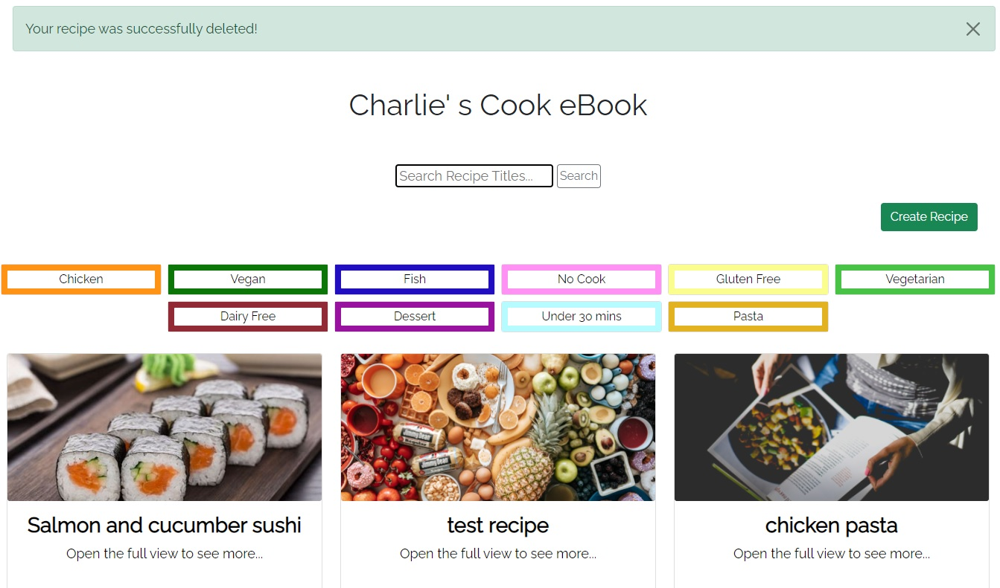

# Cook eBook

Cook eBook is an interactive web application for users who want to create and keep track of their own recipes and have quick and easy access to them from their smartphone or other devices.

This application provides users with the ability to browse other user’s public recipes on the app as well as make their own account so they can create, view and edit their own recipes in their eBook. By adding tags to their recipes, registered users can categorize their recipes and filter through their eBook with ease. 

### Deployed Site link
* [Cook eBook](https://cook-ebook.herokuapp.com/)

## Contents
---
* [Technologies Used](https://github.com/mountaincharlie/project-four-cook-ebook#technologies-used)
* [Frameworks Libraries and other Applications Used](https://github.com/mountaincharlie/project-four-cook-ebook#frameworks-libraries-and-other-applications-used)
* [Project Management](https://github.com/mountaincharlie/project-four-cook-ebook#project-management)
* [Initial Designs](https://github.com/mountaincharlie/project-four-cook-ebook#initial-designs)
* [Database Schema](https://github.com/mountaincharlie/project-four-cook-ebook#database-schema)
* [Final Designs](https://github.com/mountaincharlie/project-four-cook-ebook#final-designs)
* [User Experience Design](https://github.com/mountaincharlie/project-four-cook-ebook#user-experience-design)
* [Accessibility](https://github.com/mountaincharlie/project-four-cook-ebook#accessibility)
* [Commit Messages](https://github.com/mountaincharlie/project-four-cook-ebook#commit-messages)
* [Testing](https://github.com/mountaincharlie/project-four-cook-ebook#testing)
* [Bugs](https://github.com/mountaincharlie/project-four-cook-ebook#bugs)
* [Deployment](https://github.com/mountaincharlie/project-four-cook-ebook#deployment)
* [Credits](https://github.com/mountaincharlie/project-four-cook-ebook#credits)
* [Future Features](https://github.com/mountaincharlie/project-four-cook-ebook#future-features)

## Technologies Used
---
* HTML
* CSS
* Python
* JavaScript

## Frameworks Libraries and other Applications Used
---

* Django with;
    * gunicorn
    * psycopg2
    * postgresql
    * AllAuth
    * Crispy Forms
    * colorfield
* Bootstrap
* Cloudinary

## Project Management
---
* Using GitHub
    * [project-four-cook-ebook GitHub Projects](https://github.com/mountaincharlie/project-four-cook-ebook/projects)

* Using GitHub Projects to create Epics (big features/tasks)
    * 

* Using GitHub Issues to create User Stories and Project Maintenance (with GitHub’s labels to identify their type)
    * 

* Using GitHub's Project KanBan board feature to mark my progress throughout the project
    * 

* Using GitHub labels to prioritize User Stories (using MoSCoW prioritization)
    * 
    * 
    * 
    * 
    * 
    * 
    * 

* Using checklists within the GitHub Issues in order to specify the tasks required to achieve User Stories, Project Maintenance and Testing
    * 

## Initial Designs
---

### Home Page
* 
* 
* Header
    * Is the same across all pages
    * Clickable logo link to the homepage on the lefthand side
    * Menu on righthand side (Hamburger Menu for small screens and regular menu on larger screens)
* Before logging in the menu options are:
    * SignUp
    * Login
* After logging in the menu options are:
    * My eBook
    * Logout
* Cover Image/Site Intro paragraph
    * Fit with the design/styling of the rest of the site
    * Help make the purpose of the site immediately obvious to new users
* Search bar
    * Has placeholder text to make its purpose clear
    * Allows users to search for public recipes by all/part of their title
* Tag tiles
    * Multiple tags can be applied to any recipe
    * Each tag describes a possible feature of the recipe (e.g. Under 30 mins or Vegan etc...)
* Footer
    * Is the same across all pages
    * Link to the About page on the lefthand side
    * Link to the Contact form on the righthand side

### User’s personal eBook Page
* 
* The user must be logged in to access this page and it is specific to each user
* The user's name is displayed in the page heading
* Tag filter
    * Dropdown with the tags to select to filter the user's recipes
* Search bar
    * Has placeholder text to make its purpose clear
    * Allows users to search through their own recipes by all/part of the recipe title
* Add Recipe button
    * Clickable link to the Add Recipe page
* Recipe Cards
    * Each recipe is displayed as a card with its cover image, title, optional summary, tags and creator

### Add Recipe Page
* 
* The user must be logged in to access this page
    * The user's username is prepopulated (GET and POST method) in the non-editable 'Chef: ' field
* Title
    * For the recipe
    * Doesn't have to be unique
    * Input field (required)
* Summary
    * Optional description of the recipe
    * Visible on Recipe Cards
    * Textarea field (not required)
* Cover Image
    * If the user doesn't provide an image, then a placeholder image is automatically applied
* Ingredients
    * Input box to type new item (required)
    * Add icon to add the item to the unordered list
    * Delete icon for removing an item (user confirmation not required as nothing significant is being deleted)
* Method
    * Input box to type new step (required)
    * Add icon to add the step to the ordered list
    * Delete icon for removing a step (user confirmation not required as nothing significant is being deleted)
* Tags
    * Dropdown list of available tags (not required)
    * User selects/deselects the tags from the list which they wish to add to their recipe
* Public status
    * Checkbox (not required)
    * Unchecked (Private) by default
    * If the user checks the box inorder to make their recipe Public, a message is displayed to let the user know that the status is awaiting admin approval
* Create button
    * Saves and commits the form data to the database
    * Redirects to the View Recipe page for the newly created recipe

### View Recipe Page
* 
* Page populated with data from the recipe's database entry
* Cover Image
    * User's chosen image or placeholder image
* Recipe Title (h1)
* Created By: (the creators username)
* Status: 
    * if Private => 'Private' in a grey badge
    * if Awaiting approval => 'Awaiting Admin Approval' in a yellow badge
    * if Public => 'Public' in a green badge
* Tags
    * Whichever were added to the recipe
* Ingredients
    * Unordered list
    * Same column as Method on small screens
    * In its own column on larger screens
* Method
    * Ordered list
    * Same column as Ingredients on small screens
    * In its own column on larger screens
* Edit and Delete buttons
    * Only visible if the creator of the recipe is the user who is viewing the recipe
    * Either floating to the lower righthand side or at the bottom of the page

### Edit Recipe Page
* 
* Same layout as the Add Recipe page
* All fields are prepopulated with the recipe's data
* All fields can be edited in the same way that data could be added/deleted in the Add Recipe page
* The 'Chef' is visible but still not editable

### About Page
* 
* Site Creator section 
    * Has a brief bit about me and a link to my GitHub
* Site Purpose section 
    * Has a brief bit about the site's purpose and a link to the project's GitHub repo
* Give Feedback section
    * Only visible to logged in users
    * Has a link to my Instagram page

## Database Schema
---

### Initial Database Schema
* My intial plans for my database schema was to have:
    * A Recipe table, containing fields for recipe data (auto generated id, title, optional summary, cover image, public status, created date, unique slug and chef foreign-key) 
    * Django's User table, which would have a one-to-many relationship with the Recipe table through its Chef field (one user/chef can have many recipes)
    * An Ingredient table, containing a field for items in addition to its auto generated id field. This would have a many-to-many relationship with the Recipe table, via a one-to-many relationship with the intermediate table Recipe_Ingredient, which then also would have a one-to-many relationship with the Recipe table.
    * A Method table, containing a field for steps in addition to its auto generated id field. This would also have a many-to-many relationship with the Recipe table, through a one-to-many relationship with the Recipe_Method table.
    * A Tag table, containing a field for tags in addition to its auto generated id field. This would also have a many-to-many relationship with the Recipe table, through a one-to-many relationship with the Recipe_Tag table.
    * A Chefs_kiss table, containing a field for chefs_kisses in addition to its auto generated id field. This would also have a many-to-many relationship with the Recipe table, through a one-to-many relationship with the Recipe_Chefs_kiss table.
* I used [dbdiagram.io](https://dbdiagram.io/home) to create a visual representation of my database schema
* 

### Final Database Schema
* When it came to making my Create Recipe form, I realised that it wasn't necessary for the Ingredient and Method tables to have a many-to-many relationship with Recipe, since each user may write their method steps and ingredient items in very different ways which were specific to their own recipes. This wide variety would likely lead to many similar entries being saved into the Ingredient and Method tables without hardly any of them being reused by multiple or the same users.
* From this I decided to change my Ingredient and Method tables so that they had a one-to-many replationship with the Recipe table. So one recipe could have many ingredient items and many method steps, but each item and step would belong to only one recipe.
* My new database schema in [dbdiagram.io](https://dbdiagram.io/home): 
* 

## Final Designs
---

### Header and footer
* For users who are not logged in:
    * 
    * 
* For users who are logged in:
    * 
    *  
* Changes from initial design:
    * Using Instagram link instead of Contact form page. The contact form could be a future feature to add.

### Home Page
* Desktop and mobile final designs
    *  
    *  

### User’s personal eBook Page
* Desktop and mobile final designs
    *  
    * 
* Changes from initial design:
    * Small Tag Tiles are displayed for searches with tags instead of a dropdown filter. I think that having the Tags displayed as Tiles helps with consistency between the homepage and personal eBook as well as being visually easier for users to see the avaliable Tags.
    * 'Create' instead of 'Add'. Fits with the site intro text: DISCOVER CREATE SHARE.
    * Recipe cards in the user's eBook display the public status of the recipe instead of the chef name since the user would be the chef for all of the recipes in their eBook.

### Add Recipe Page
* Desktop and mobile final designs
    *  
    * 
* Changes from initial design:
    * No public status checkbox. This could be a future feature. Instead there is a message at the bottom of the page to explain how the public status works.
    * Tags are checkboxes not in a dropdown filter. This way they're easier to see and change.

### View Recipe Page
* Desktop and mobile final designs
    *  
    * 
* Changes from initial design were just the layout so that it was more symmetrical:
    * Chefs kisses are on the page bottom left side.
    * The Edit and Delete buttons are at the page bottom right side.
    * The tags are horizontally central on the page.
    * The public status is on the top right side inline with the chef name.

### Edit Recipe Page
* Desktop and mobile final designs
    *  
    * 
* Changes from initial design:
    * No public status checkbox. This could be a future feature. Instead there is a message at the bottom of the page to explain how the public status works.
    * Tags are checkboxes not in a dropdown filter. This way they're easier to see and change.
    * The order of the Save, Delete and Cancel buttons. The cancel button is then closest to where the user's thumb/palm may touch the screen on a phone.

### About Page
* Desktop and mobile final designs
    *  
    *   

## User Experience Design
---

### Mobile First Design With Bootstrap
* I used Bootstrap's [Grid System](https://getbootstrap.com/docs/5.0/layout/grid/) in order to make use of its ability to rearrange columns on the screen depending on its screen size.
* By using this I was able to create my site designs with a Mobile First Design approach in mind.
* An example of where I made use of this Grid System for switching between desktop and mobile screens, was in how recipe's details are displayed in each view:
    * 
    * 
* You can see that in the desktop view the 'Chef' and 'Status' are in two columns and so are the 'Ingredients' and 'Method', but in mobile view 'Chef' and 'Status' move into one column and 'Ingredients' and 'Method' move into one column.

### Consistency
* Making use of Django as a templating language, I created a base.html file with header, main and footer sections.
* Each of my other pages then extended from this base.html and their content appears in the main element section, so all of the pages have the same header and footer design and functionality.
* Each of the template html files also follow Bootstraps grid system and primarily use bootstrap classes for styling so that the layout is familiar across the whole site.
* Each page also has the same font for headings and for other text content so this also remains consistent throughout the site.

### Specific Feedback Messages To Users 
* Successful signup/login message:
    * 
* Successful logout message:
    * 
* Successfully created recipe message:
    * 
* Successfully edited recipe message:
    * 
* Successfully deleted recipe message:
    * 

### Navigation
* The site logo is a clickable link back to the homepage
* Features such as the 'About' page and the 'Signup/Login and My eBook/Logout' links are avaliable in the footer/header in all pages, so the user doesn't have to go anywhere in order to use these features.
* Return To My eBook and Return To Tag Tiles buttons so that the user can navigate easily from their search results back to the Tag Tiles or to their eBook, depending on which page they made the search.
    * 
    * 
* Cancel button on Edit Recipe and Delete confirmation pages so that the user deosn't have to use the browsers back button in order to cancel out of either of these pages.
    * 
    * 

## Accessibility
---

### Lighthouse Accessibility Score
* 

### Semantic Elements
* Using 'header', 'nav', 'main' and 'footer' in base.html to make the roles of each section obvious.
* Adding role="button" for link elements which are being used as buttons

### Aria-Labels
* Added aria-labels to all link and button elements

## Commit Messages
---

* In order to improve my Git Commit messages, following feedback on previous projects, I decided to use [Conventional Commit’s](https://www.conventionalcommits.org/en/v1.0.0-beta.2/) recommended commit message structure. 
* I used a mixture of their recommended Types and some of my own:
    * feat - new feature
    * fix - bug fixes
    * docs - documentation only changes
    * style - changes not affecting the code meaning (e.g. removing blank lines)
    * refactor - code change which isnt a fix or feature
    * test - adding a missing/correcting an existing test
    * chore - changes not affecting the source or test file (e.g. deleting unwanted files)
    * setup (custom type) - installing dependencies and adding setup code for them
* They also suggested using square brackets after the Type to add an optional Scope, which would be the thing that the commit applies to, if necessary.
* The commit messages follow the structure:
    * "type[optional scope]: commit description"

## Testing
---

### Automated Testing with Django
* In order to run these tests, I needed Django to use sqlite3 as a local database. To do this I created a 'TESTING' variable in my env.py file and then in settings.py I added an If Statement which checked for this variable and used the sqlite3 database if it was found. When I was not running tests, I commented out this variable and so Django instead used my postgresql database.
    * in my env.py:
    * 
    * in my settings.py:
    * 
* Rather than create all my tests in one test.py file, I decideed to split them into:
    * test_models.py
    * test_urls.py
    * test_forms.py
    * test_views.py

### Testing models in test_models.py:
* Tested to make sure that when a recipe is created, its 'public_status' is set to 'Private'/0 by default
* Tested to make sure that the Recipe class' 'number_of_chefs_kisses' method calculated the number of chefs kisses correctly
* Tested that when a new tag is created by the admin, the color assigned to it must be unique
* Tested that the slug field for all recipes must be unique
* Tested that the function that generates the random slugs, does generate random and unique slugs for different recipes
* All of these tests were successful

### Testing urls in test_urls.py:
* Tested that each of my urls resovles correctly.
* The tests were succesful for all of my urls

### Testing forms in test_forms.py:
* Tested that title is a required field for recipes
* Tested that chefs_kisses is not a required field for recipes
* Tested that tags is not a required field for recipes
* Tested that cover_image is not a required field for recipes
* Tested that ingredient items are not required
* Tested that method steps are not required
* All of these tests were successful

### Testing views in test_views.py:
* Tested the home url is successfully reversed and the correct template is used
* Tested the RecipeSearchView view class' get method is successfully reversed and the correct template is used
* Tested the recipe_details url is successfully reversed and the correct template is used
* Tested the create_recipe url is successfully reversed and the correct template is used
* Tested the about url is successfully reversed and the correct template is used

### Initial Coverage
* After implementing 29 successful tests across my models, urls, forms and urls, I installed Django Coverage.
* Django Coverage installation to viewing html report (following [Code Institute's video](https://learn.codeinstitute.net/courses/course-v1:CodeInstitute+FST101+2021_T1/courseware/dc049b343a9b474f8d75822c5fda1582/5666926980b74689b37a0d5da3cec510/)):
    * pip3 install coverage
    * set os.environ['TESTING'] = 'yes' in my env.py
    * coverage run --source=cook_ebook manage.py test
    * coverage report
    * coverage html
    * python3 -m http.server 
* Initial coverage report: 80%
* 
* From the report I could see that my:
    * models.py was missing tests for the __ str __ methods
    * admin.py was missing tests for my make_private(), make_public() and make_awaits() methods
    * views.py was running 63 tests but missing 76 tests
* So I revisited my test files in order to cover as many of these missing tests as possible
 
### Further Tests
* For models.py I added automated tests for:
    * the four __ str __ methods
    * these test all passed
    * models.py then had 100% coverage
    * my overall code coverage became 82%
* For admin.py I struggled to write the automated tests so I did manual tests for:
    * the make_private() method
    *  method manual test")
    * the make_public() method
    *  method manual test")
    * the make_awaits() method
    *  method manual test")
* For views.py I struggled to write the automated tests so I did manual tests for:
    * 1 - Chefs kiss icon updates number of Chef's Kisses for the recipe
    * 
    * 2 - The user's recipes are displayed in their My eBook page
    * Screen shot of the recipes listed in the admin panel as belonging to the user 'Charlie':
    * 
    * Screen shot of the recipes listed in the user 'Charlie''s eBook:
    * 
    * 3 - The user can search their recipes by title in the searchbar or select a tag tile to view all their recipes with that tag on their My eBook page
    * Screenshot of a public recipe by chef 'Marcus, which is visible from a search in the homepage:
    * 
    * Screenshot of the search results within Charlie's eBook for a search of 'chicken' either by the tag or in the searchbar:
    * 
    * You can see that Marcus' recipe is not visible here, only Charlie's.
    * 4 - The user can create a recipe and is redirected back to their My eBook page with success message
    * Screenshot of a user creating a recipe:
    * 
    * 
    * Screenshot of the redirect back to the user's ebook page after clicking Create:
    * 
    * You can see the success message which is displayed and that the new recipenow displays as a recipe card in the user's eBook page
    * 5 - The user can edit a recipe and is redirected back to their My eBook page with success message
    * Screenshot of the user adding a new tag and changing some of the ingredients:
    * 
    * Screenshot of the redirect back to the user's eBook with success message:
    * 
    * Screenshot of the recipe showing the changes have been applied:
    * 
    * 6 - The user can delete a recipe and is redirected back to their My eBook page with success message
    * Screenshot of the delete recipe confirmation page:
    * 
    * Screenshot of the redirect back to the user's eBook with success message:
    * 
    * You can see that the Vegan Chocolate Cake recipe has been deleted

### Manual Testing Other Features
* Users can only see the 'Edit' and 'Delete' buttons for a recipe if they are the Chef for that recipe
    * Screenshot of Charlie viewing one of their own recipes, so the Edit and Delete buttons are there:
    * 
    * Screenshot of Charlie viewing a recipe by Marcus, so the Edit and Delete buttons are not there:
    * 
* User's can only view their own My eBook page
    * Screenshot of Charlie trying to view Marcus' eBook page by manually changing the url:
    * 
    * Screenshot of Charlie being taken to the This is not your eBook page:
    * 
* User's only have access to their My eBook page when logged in
    * Screenshot of the header navbar when the user is not logged in:
    * 
    * Screenshot of the header navbar when the user is logged in:
    * 
* User's can only see the link to my Instagram page (to give feedback) when logged in
    * Screenshot of when the user is not logged in:
    * 
    * Screenshot of when the user is logged in:
    * 
    * You can see that the footer has changed (in base.html, so for all pages) and that the Give Feedback section is visible in the About page

### Manual JavaScript tests
* The Add Ingredient button creates another ingredient form
    * Clicking the Add An Ingredient button:
    * 
    * New ingredient form added and the user can type into the box:
    * 
* The Delete Ingredient button deletes its ingredient form
    * Clicking the Delete Ingredient button:
    * 
    * Ingredient form deleted:
    * 
* The Add Step button creates another method form
    * Clicking the Add Step button:
    * 
    * New method form added and the user can type into the box:
    * 
* The Delete Step button deletes its method form
    * Clicking the Delete Step button:
    * 
    * Method form deleted:
    * 
* The changes are visible in the recipe detailspage:
    * 
* Tag tiles which have already been assigned to a recipe show as ticked checkboxes in the Edit Recipe page
    * In the recipe details page:
    * 
    * In the edit recipe page:
    * 

### Final Coverage 
* After implementing 33 successful tests across my models, urls, forms and urls, I installed Django Coverage.
* 
* The areas I was not able to cover with automated testing, I tried to test thoroughly with manual testing (documented in the above sections). 

### PEP8 and Pylint Python Validators
* admin.py 
    * has pylint warning 'Unsued argument 'request'' for each of my public_status update methods, but this argument is used in the methods without explicitly typing it in.
    * PEP8 result: All Right
* apps.py
    * no pylint errors or warnings
    * PEP8 result: All Right
* forms.py 
    * has pylint error 'Class 'Tag' has no 'objects' member', but using 'objects' to get the objects created with the Tag model does work fine.
    * PEP8 result: All Right
* models.py 
    * has pylint error 'Instance of 'ManyToManyField' has no 'count' member', but the method does successfully count the number of chefs kisses.
    * PEP8 result: All Right
* urls.py
    * no pylint errors or warnings
    * PEP8 result: All Right
* views.py 
    * has pylint errors 'Tag/Recipe/Ingredient/Method has no 'objects' member', but using 'objects' to get the objects created with each of these models does work fine.
    * has pylint errors 'line too long', but these are only for the messages I'm passing to the user for when there are no recipes with a particular tag or with all or part of their search in the title and I can't break these messages onto different lines without causing serious errors.
    * has pylint warning 'Unsued argument 'arg/kwargs'' for each of my class based views methods, but these are passed in as optional arguments.
    * PEP8 result: only 3 'line too long' errors, explained above
* test_forms.py 
    * no pylint errors or warnings
    * PEP8 result: All Right
* test_models.py 
    * has pylint errors 'Tag/Recipe/Ingredient/Method has no 'objects' member', but using 'objects' to get the objects created with each of these models does work fine.
    * PEP8 result: All Right
* test_urls.py 
    * no pylint errors or warnings
    * PEP8 result: All Right
* test_views.py 
    * has pylint errors 'Tag/Recipe has no 'objects' member', but using 'objects' to get the objects created with each of these models does work fine.
    * PEP8 result: All Right

### HTML Validation in Offical W3C Validator
* base.html
    * has some Offical W3C Validator errors for using {{ }} and  syntax, but these are necessary for Django functionality
* index.html
    * has some Offical W3C Validator errors for using {{ }} and  syntax, but these are necessary for Django functionality
    * has some Offical W3C Validator errors for missing head element information, but this file extends from base.html which contains the head element
    * has 2 errors for 'property value expected' and 'at-rule or selector expected' where I have used inline styling, but this was where I used the tag.color database value inorder to apply colour to each tag tile. The reason for using inline styling was that the the color style I'm applying is given a value from the database, rather than a manual colour and this is not a property I would ever want to change in my css file. Changing this color is only possible through changing it in the actual database, which works fine.
* about.html
    * has some Offical W3C Validator errors for using {{ }} and  syntax, but these are necessary for Django functionality
    * has some Offical W3C Validator errors for missing head element information, but this file extends from base.html which contains the head element
* recipe_details.html
    * has some Offical W3C Validator errors for using {{ }} and  syntax, but these are necessary for Django functionality
    * has some Offical W3C Validator errors for missing head element information, but this file extends from base.html which contains the head element
    * has 1 error for 'property value expected' and 'at-rule or selector expected' where I have used inline styling, but this was where I used the tag.color database value inorder to apply colour to each tag tile. The reason for using inline styling was that the the color style I'm applying is given a value from the database, rather than a manual colour and this is not a property I would ever want to change in my css file. Changing this color is only possible through changing it in the actual database, which works fine.
* my_ebook.html
    * has some Offical W3C Validator errors for using {{ }} and  syntax, but these are necessary for Django functionality
    * has some Offical W3C Validator errors for missing head element information, but this file extends from base.html which contains the head element
    * has 3 errors for 'property value expected' and 'at-rule or selector expected' where I have used inline styling, but this was where I used the tag.color database value inorder to apply colour to each tag tile. The reason for using inline styling was that the the color style I'm applying is given a value from the database, rather than a manual colour and this is not a property I would ever want to change in my css file. Changing this color is only possible through changing it in the actual database, which works fine.
* create_recipe.html
    * has some Offical W3C Validator errors for using {{ }} and  syntax, but these are necessary for Django functionality
    * has some Offical W3C Validator errors for missing head element information, but this file extends from base.html which contains the head element
* edit_recipe.html
    * has some Offical W3C Validator errors for using {{ }} and  syntax, but these are necessary for Django functionality
    * has some Offical W3C Validator errors for missing head element information, but this file extends from base.html which contains the head element
* delete_recipe.html
    * has some Offical W3C Validator errors for using {{ }} and  syntax, but these are necessary for Django functionality
    * has some Offical W3C Validator errors for missing head element information, but this file extends from base.html which contains the head element
* customised version of django-all_auth's login.html
    * has some Offical W3C Validator errors for using {{ }} and  syntax, but these are necessary for Django functionality
    * has some Offical W3C Validator errors for missing head element information, but this file extends from base.html which contains the head element
* customised version of django-all_auth's logout.html
    * has some Offical W3C Validator errors for using {{ }} and  syntax, but these are necessary for Django functionality
    * has some Offical W3C Validator errors for missing head element information, but this file extends from base.html which contains the head element
* customised version of django-all_auth's signup.html
    * has some Offical W3C Validator errors for using {{ }} and  syntax, but these are necessary for Django functionality
    * has some Offical W3C Validator errors for missing head element information, but this file extends from base.html which contains the head element

### CSS Validation in Offical Jigsaw Validator
* style.css
    * no errors or warnings in Offical Jigsaw Validator

### JS Check in JSHint
* script.js
    * no errors or warning in JSHint

## Bugs
---

### Bugs and Fixes
* Bug: trying to allow the admin to search recipes by 'chef', in the admin pannel, raised a FieldError
    * Fix: using '__' notation to search by 'chef__username' instead, as reccomended by [markwalker_](https://stackoverflow.com/a/65689026). Also in Django documentation for [ModelAdmin.search_fields](https://docs.djangoproject.com/en/3.1/ref/contrib/admin/#django.contrib.admin.ModelAdmin.search_fields).
* Bug: when opening the expandable navigation on small screens, on the homepage, the menu obscured the site intro text.
    * Fix: instead of using css to manually overlay the site intro text over the cover image, I set the cover image as the background-image for the site-intro-container in css. Now when the mobile navigation is expanded, the cover image and site intro text move down together.
* Bug: the RecipeDetailsView view class was storing all the public recipes in a public_recipes varible which was used to get the specific recipe to take the user to it details page, but this meant that when a user was trying to open a private recipe within their personal My eBook page, the view didnt work
    * Fix: changing 'public_recipes = Recipe.objects.filter(public_status=1)' to 'recipes = Recipe.objects.all()'. This still worked in the homepage and for user not logged in since the searchbar and Tag Tiles search functionality limit the displayed recipe cards to only those that are Public anyway.
* Bug: Having set Ingredient and Method as having a many-to-many relationship with Recipe, I found that adding Ingredient items and Method steps, within my create_recipe form, was very confusing as it allowed any particular item or step to be associated with many recipes. Since users chosen ingredients and method steps would vary so much it didn't make sense to need to associate any particular ingredient or method step with multiple recipes.
    * Fix: I changed my database model so that both Ingredient and Method had one-to-many relationships with Recipe, thus allowing a recipe to have many ingredients and method steps but not requiring that any of the specific ingredients or method steps should be able to apply to other recipes. 
* Bug: when submitting the create_recipe form, trying to add the tags the user selected to the recipe raised the ValueError: "< Recipe: tags >" needs to have a value for field "id" before this many-to-many relationship can be used.
    * Fix: saving the recipe with: recipe.save(), so that the recipe exists and therefore has a value for field 'id, before trying to populate the tags ManyToManyField.
* Bug: when I made my final deployment to Heroku and opened my app, my home page cover image was missing. This issue was being caused by my css file not being able access the cloudinary link to the cover image.
    * Fix: copying the exact url from Cloudinary for my image and then pasting that in as the url for my site-intro-container background image in my style.css file.
* My Helpful Resources subsection in the Credits section also lists resources which helped me to work out how to code particular parts of my project. Whilst these did't show up specifically as bugs, the resources did help me solve/fix problems I encountered whist trying to create all the functinoality for my project

### Unfixed Bugs
* No known unfixed bugs (other than warnings/errors explained in code validation section)

## Deployment
---

### Early Deployment to Heroku
* First I created the cook-ebook app on Heroku
* Then I added my Heroku Postgres database in Heroku's Resources -> Add Ons
* I created an env.py file in my root directory and made sure that it was listed in my .gitignore so that it would never be commited to GitHub
* I copied the link to my Heroku database from the Heroku Config Variable and pasted it into my env.py file
* In my env.py file I created variables for my DATABASE_URL and my SECRET_KEY
* I gave my SECRET_KEY a value and created a Heroku Config Variable for this 
* I then changed my default database to use dj_database_url and DATABASE_URL
* In my settings.py file I set my Heroku app as a localhost in my ALLOWED_HOSTS variable
* After installing Cloudinary, I created a 'DISABLE_COLLECTSATIC' Config Variable in Heroku with a value of '1', since I didn't have any staticfiles at that time
* I then created a Procfile for my app
* Finally I used the Command Line Interface to:
    * login to my Heroku app
    * select my app
    * push my commited changes to 'heroku main'

### Final Deployment
* In settings.py I created the variables:
    * ACCOUNT_EMAIL_VERIFICATION = 'none'
    * DEBUG = False
    * X_FRAME_OPTIONS = "SAMEORIGIN"
* I then removed my 'DISABLE_COLLECTSATIC' Config Variable since I did have staticfiles
* Finally I used the Command Line Interface to:
    * login to my Heroku app
    * select my app
    * push my commited changes to 'heroku main'

### Deployed site link
* [Cook eBook](https://cook-ebook.herokuapp.com/)

## Credits
---

### Helpful Resources
* [JPG's solution on stackoverflow](https://stackoverflow.com/a/64218886) for how to test IntegrityError Unique Constraint to make sure that newly created Tags cannot have the same color as existing Tags.
* [David Roseman's solution on stackoverflow](https://stackoverflow.com/a/24599835) for how to access the primary key of a particular item in the database. I used this so that when a user clicks on a Tag Tile, the primary key of that tag is attached to the url path and is also used in the RecipeByTagView class to filter the recipes by those which contain that particular tag.
* [JustDjango's youtube video](https://youtu.be/vU0VeFN-abU) for how to use the '__icontains' method, so that I could check if the user's input in the searchbar contained all or part of a recipe's title.
* [Codemy's youtube video](https://youtu.be/zb4fIvtn4tY) for how to use the 'get_context_data' method (used in my UsereBookView class view) in order to find the recipes created by the current user to display them when in the user's My eBook page.  
* [Brian's blog](https://engineertodeveloper.com/getting-started-with-formsets-create-a-recipe-app/) on how to use formsets to add ingredients to a recipe. I used Brian's method and adapted it to suit my forms and to also include adding method steps to recipes. 
* [nmb.ten's solution on stackoverflow](https://stackoverflow.com/a/18247059) for how I could automatically set the Chef, for newly created recipes, as the current user, by executing recipe.chef = User.objects.get(id=self.request.user.id) before saving and commiting my the recipe_form.
* [CodingEntrepreneurs's youtube video](https://youtu.be/quJzUzCs6Q0) for how to add placeholder text in form fields so that I could have the placeholder 'Recipe Title' in the Title input field.
* [Willem Van Onsem's solution on stackoverflow](https://stackoverflow.com/a/60479660) for how to use ModelMultipleChoiceField in forms.py to create a multiple choce checkbox input in my form for the tags field.
* [Silver Light's solution on stackoverflow](https://stackoverflow.com/a/2417136) for how to get the checked checkboxes value from a form in the views.py post method. I used this in order to get the values for the tags that a user chooses to add to a recipe. 
* [aero's solution on stackoverflow](https://stackoverflow.com/a/38166800) for how to properly use .set() so that I could add the tags which a user selected to their recipe instance.
* [Aidas Bendoraitis' solution on stackoverflow](https://stackoverflow.com/a/13148812) for needing to include: request.FILES to my form within the post method of my CreateRecipeView, so that I could assign upload_image to recipe.cover_image.
* [Vijesh Venugopal's solution on stackoverflow](https://stackoverflow.com/a/47719052) for including: enctype="multipart/form-data" as an attribute in my form, so that in my views.py I could access the upload_image with: request.FILES.
* [httpete's solution on stackoverflow](https://stackoverflow.com/a/8432018) for using {{ request.path }} within a template inorder to get the current url path. I used this so that I could check if the logged in user's id matched the id passeed into the url for the user who owns the eBook and if not, then the user was informed that this wasnt their eBook. This was to stop user's being able to access another user's my_ebook page by changing the url.
* [scytale's solution on stackoverflow](https://stackoverflow.com/a/7405779) for using: |slugify to coerce an integer into acting as a string so that I could compare the user.id with the id in the url, when checking if the user was authorised to view a particular my_ebook page.
* [solution on reddit thread](https://www.reddit.com/r/learnjavascript/comments/5j5quz/add_eventlistener_to_all_buttons_of_class/) for how to add an event listener to all buttons with a particular class. I used this so that when a user is creating a recipe, each time they add an ingredient or method step, there is a delete button that comes with it and has a click Event Listener attached to it in order to delete that specific ingredient or method step.
* [JavaScript Tutorial's page](https://www.javascripttutorial.net/javascript-dom/javascript-checkbox/) for how to use JavaScript to set a checkbox as 'checked'. I used this so that when a user clicks on my delete buttons for ingredients/method steps, it triggers the formset's delete checkbox to be checked so that the field is actually deleted and not just removed from the page.
* [Ned Batchelder's solution on stackoverflow](https://stackoverflow.com/a/12654998) for how to set a default for a model field as a method. I used this so that I could set the slug for each recipe as a string of a random 20 numbers between 0 and 100. This was so that my slugs were unique and did not contain the Recipe's Primary Key, so I could safely use this slug in the url for each Recipe.
* [The Dumbfounds' YouTube series](https://youtu.be/qwypH3YvMKc) on Django Testing, for advice on how to setup basic tests in Django.
* [dbdiagram.io](https://dbdiagram.io/home) for creating my intitial and final database schema designs.

### Content
* JavaScript and div structure for dynamically adding Ingredients and Method steps inline formsets
    * I used [CodingEntrepreneurs' YouTube video](https://youtu.be/s3T-w2jhDHE) inorder to build the JavaScript and formset div structure I needed to dynamically add ingredients and method steps. I added my own comments to describe the process as well as the specific styling and constant names which were suited to this project.
    * [UPDATE] due to the nature of my specific project; the custom delete buttons I added and checking for exisiting ingredients and methods before more can be added, the JavaScript for this project became almost entirely my own custom code. So in the end I only really used CodingEntrepreneurs' idea of having a hidden new form which I used to add new ingredients and methods and I also used his idea for changing the id of new ingredients and methods by using regular expressions.
* Fonts: 
    * Google Font's [Lato](https://fonts.google.com/specimen/Lato?query=lato) for headings and the text in the header and footer.
    * Google Font's [Raleway](https://fonts.google.com/specimen/Raleway?query=Raleway) for the rest of the text content on the site.

### Code
* installed [django-colorfield](https://github.com/fabiocaccamo/django-colorfield) by [Fabio Caccamo](https://github.com/fabiocaccamo), originally developed by [Jared Forsyth](https://github.com/jaredly). Used to create a color field in the Tag table so that each Tag can have a unique color associated with it in order to create the Tag tiles.

### Media
* Images:
    * [Image](https://unsplash.com/photos/Yn0l7uwBrpw?utm_source=unsplash&utm_medium=referral&utm_content=creditShareLink) by Jimmy Dean on Unsplash, used as the site's homepage and About page cover image.
    * [Person reads cookbook recipe](https://unsplash.com/photos/5O1ddenSM4g?utm_source=unsplash&utm_medium=referral&utm_content=creditShareLink) by Dan Gold on Unsplash, used as a placeholder cover image for recipes when the user chooses not to upload their own image.
* Icons:
    * Font Awesome's [solid face-kiss-wink-heart](https://fontawesome.com/icons/face-kiss-wink-heart?s=solid) for when a logged in user clicks/has previously clicked the 'Chefs Kiss' button for a recipe
    * Font Awesome's [regular face-kiss-wink-heart](https://fontawesome.com/icons/face-kiss-wink-heart?s=regular) for when a non-logged in user sees the 'Chefs Kisses' for a recipe and when a logged in user clicks the 'Chefs Kiss' button for a recipe again to undo their 'Chefs Kiss'
    * Font Awesome's [solid fa-cookie-bite](https://fontawesome.com/icons/cookie-bite?s=solid) as part of the logo for the site
    * Made Font Awesome's [solid fa-cookie-bite](https://fontawesome.com/icons/cookie-bite?s=solid) into a favicon with [favicon.io](https://favicon.io/)
    * Font Awesome's [fa-brands fa-instagram](https://fontawesome.com/icons/instagram?s=brands) as the link to my Instagram page to leave feedback.

## Future Features
---
Ideas that could be used to expand the site's functionality. 

### Users can order the recipe's displayed by date or popularity
* Could have a radio button for or dropdown filter for showing the recipe cards in order of most recently created or by popularity (how many chefs kisses they have).

### Users can register with social media accounts
* Could use django-all_auth's templates for allowing the user to login with one of their social media accounts.

### Public status change checkbox
* There could be a checkbox in the Create/Edit recipe form which the user can tick if they want their recipe to be made public. Ticking this box would set the recipe's public_status to 'awaits' and the user would be notified that their recipe is waiting for an admin to make it public. 
* For public recipes, this checkbox could be used to set the recipe back to private (no admin authorisation required)

### Contact form
* Could have a contact form page for logged in users. The user would have checkboxes they can select to indicate the type of feedback (question, bug found, improvement idea etc...). The feedback would be set as 'generic feedback' if no tickbox was selected.
* The user's username would already be populated into the form so that they wouldn't have to add any information we already have.
* The Email JS API could be used to manage the user's feedback as an email sent to me.

### List of equipment required
* Could have an optional section on the Create/Edit recipe form where the user can include a list of the equipment you would need for the recipe.

### Saving to favourites
* Could have a section of the user's eBook where they can save favourites from their own recipes and others' public recipes.

### Create shoppping list
* Could have a button for user to add all the ingredients from a recipe into a personal Shopping List page.

### Verified Users
* If a user has had 10 or more of their recipes approved as public by the admin, they could become a Verified User and then their recipes could be set to public without needing to await admin decision.
* Although the verified user's recipe can be made public whenever they want, the admin would still be able to override this action and even remove the user's 'verified' status.

### Sharing recipes
* Logged in users have the option to share any of their recipes or other's public recipes on social media (Facebook, Instagram, Whatsapp etc...) or get a link to share by email etc...

### Custom Tags
* Could allow users to create their own custom tags (only usuable on their eBook).
* The admin may need to approve a user's tag if it is on a recipe which is already public or one that is trying to be made public, to ensure no harmful content is posted for other users to see.
* Could be that only 'verified users' can have this feature.